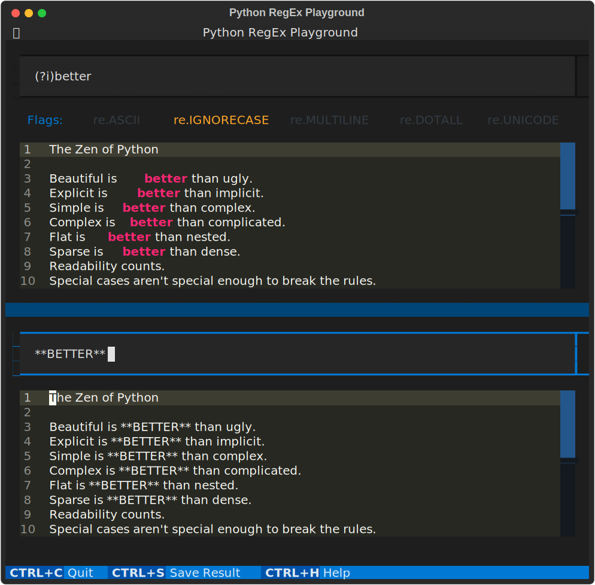

# Python RegEx Playground

Learn, Build, & Test Python Flavored RegEx inside your terminal.



```bash
$ regex-playground -h
usage: regex-playground [-h] [--version] [file ...]

Learn, Build, & Test Python Flavored RegEx.

positional arguments:
  file        text to load into the playground

options:
  -h, --help  show this help message and exit
  --version   show program's version number and exit

Copyright 2023 Josh Duncan (joshbduncan.com)
```

## Resources

- [Textual](https://github.com/Textualize/textual)
- [Python Regular Expressions](https://docs.python.org/3/library/re.html)
